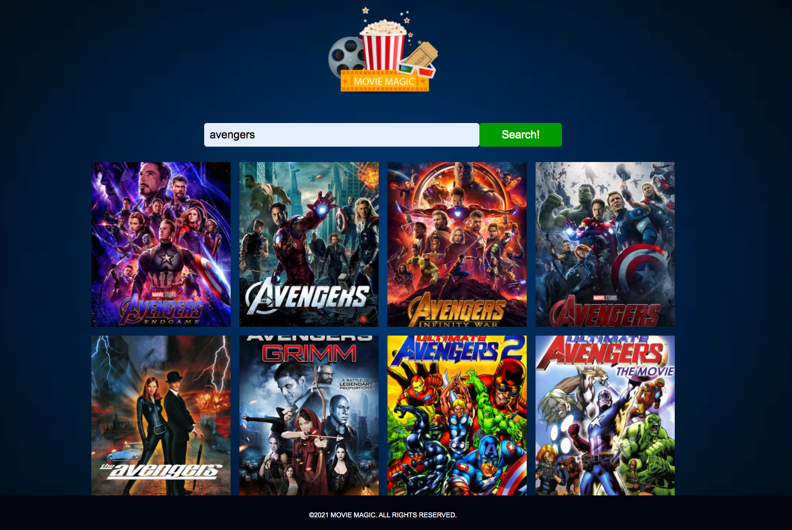
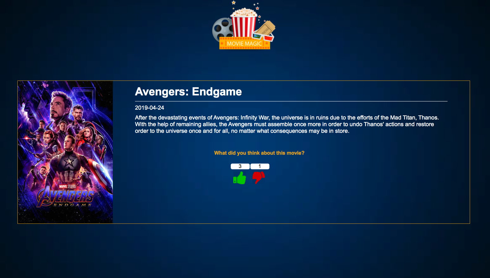

## Movie Magic

Movie Magic is a small web application that allows a user to search for a movie title, click on that movie title for more information, and give that movie a thumbs up or thumbs down.




## Tech Stack

JavaScript, React(React Hooks were used), HTML, CSS
This project was bootstrapped with Create React App.
## Setup

```
git clone https://github.com/AminatP/moviemagic
cd moviemagic

npm install
npm run
```
Movie API setup:

- Obtain an API Key from TheMovieDB API (https://www.themoviedb.org)
- Create a .env file in the root directory and add your API Key info:

```
REACT_APP_API_KEY=paste your key

```
